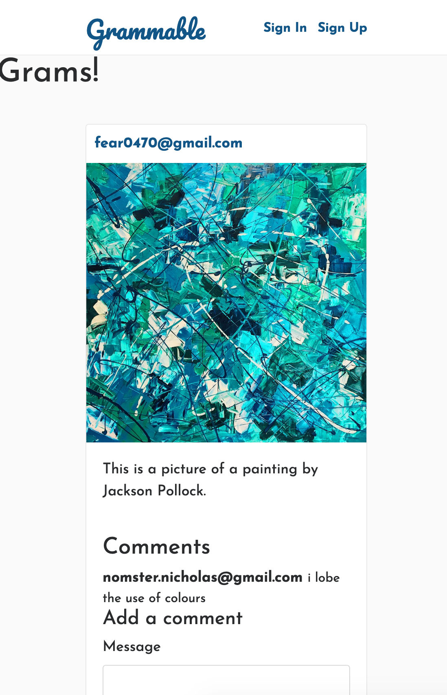

<h1>Grammable</h1>
Grammable was written in Ruby on Rails framework.

Grammable is an Instagram clone app that lets users share photos with their friends and comment on those photos. Sign up here and start sharing your photos now!
<h3>Features:</h3>
<ul>
  <li> Amazon Web Services (S3) for photo storage to let users upload their photos. </li>

  <li> Twitter Bootstrap 3 for CSS and components. </li>

  <li> PostgreSQL for database queries involving users, photos, and comments. </li>

  <li> Devise for user forms and security. </li>
</ul>
####### Here's a sneak peek at the Grammable feed. 

